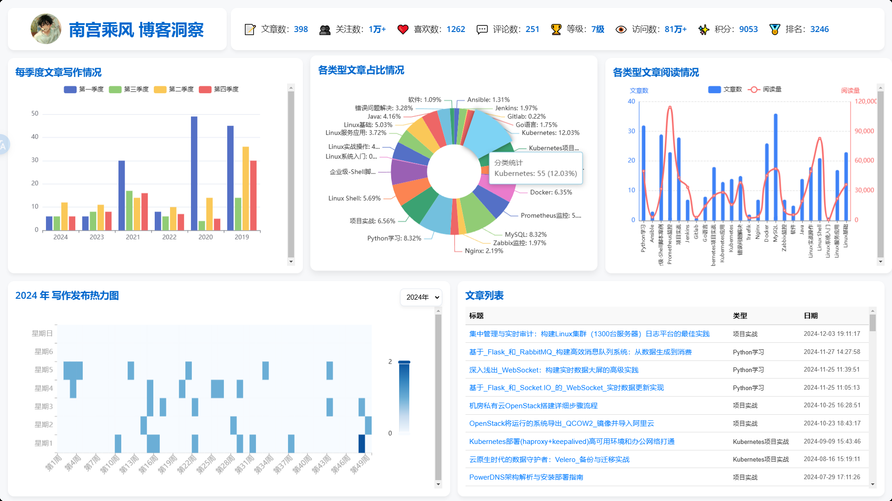
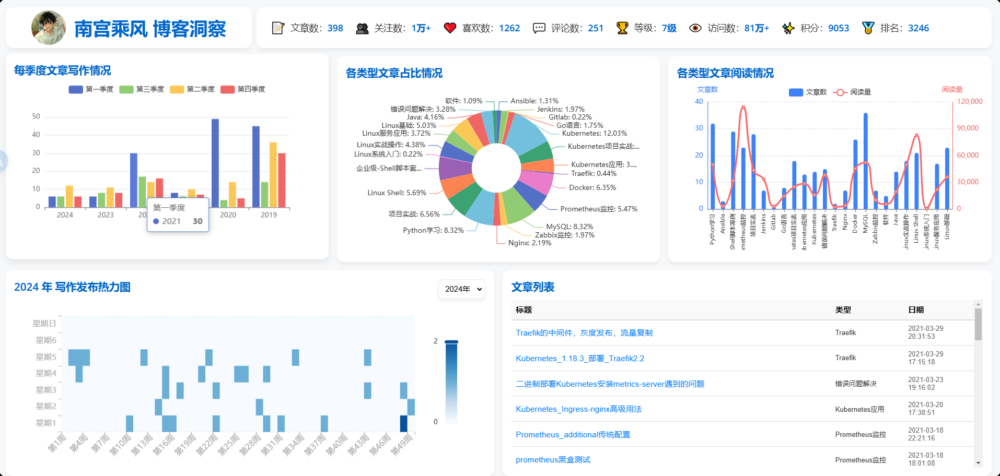

# CSDN博客洞察看板 🚀

## 项目简介

这是一个基于Python Flask和ECharts的CSDN博客数据可视化项目，旨在提供对个人博客数据的深入洞察和交互式展示。

## 🌟 功能特点

1. **博客统计仪表盘**
   - 展示博主基本信息（文章数、关注数、访问量等）
   - 多维度数据可视化

2. **交互式图表**
   - 季度文章数量柱状图
   - 博客分类饼图
   - 文章阅读量混合图
   - 文章发布热力图

3. **数据筛选与交互**
   - 支持按年份、季度、类型筛选文章
   - 图表交互式点击事件

## 🛠 技术栈

- **后端**: Python, Flask
- **前端**: HTML5, JavaScript, ECharts
- **数据库**: SQLAlchemy, MySQL
- **依赖管理**: 
  - Flask
  - SQLAlchemy
  - axios

## 📦 项目结构

```bash
CsdnBlogBoard/
├── app.py # 主应用程序入口
├── api/
│ └── csdn.py # CSDN数据处理API
├── models.py # 数据库模型
├── static/
│ └── js/
│ └── main.js # 前端交互脚本
├── templates/
│ └── index.html # 主页模板
└── README.md # 项目说明文档
|__ spider.py # CSDN数据爬虫入库
```


# 说明文档


## 🚀 快速开始

1. 克隆项目
```bash
git clone https://github.com/nangongchengfeng/CsdnBlogBoard.git
cd CsdnBlogBoard
```
2. 安装依赖
```bash
pip install -r requirements.txt
```
3. 配置数据库

- 修改 `app.py` 中的数据库连接配置
- 创建数据库并初始化表结构

4. 运行项目
```bash
python app.py
```
5. 访问项目
打开浏览器访问 `http://localhost:5000`

🔍 主要功能截图

**全屏**



**浏览器打开**




## 🤝 贡献指南

1. Fork 本仓库
2. 创建你的特性分支 (`git checkout -b feature/AmazingFeature`)
3. 提交你的修改 (`git commit -m '添加了某某特性'`)
4. 推送到分支 (`git push origin feature/AmazingFeature`)
5. 提交 Pull Request

## 📄 许可证

本项目采用 MIT 许可证。详见 `LICENSE` 文件。

## 🌈 作者

- **南宫乘风**
- 联系邮箱: 1794748404@qq.com